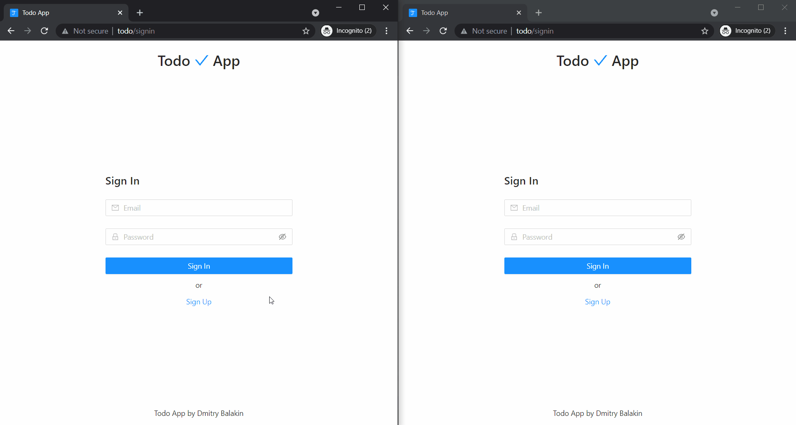
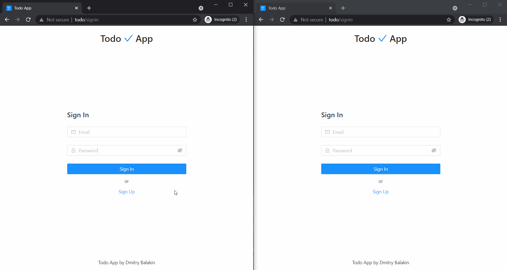
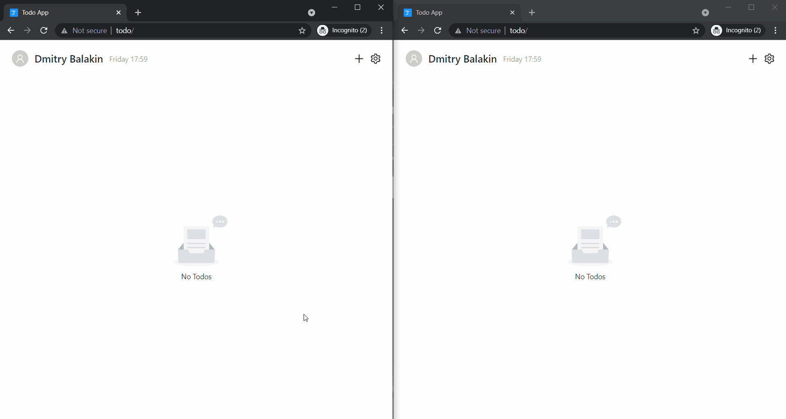
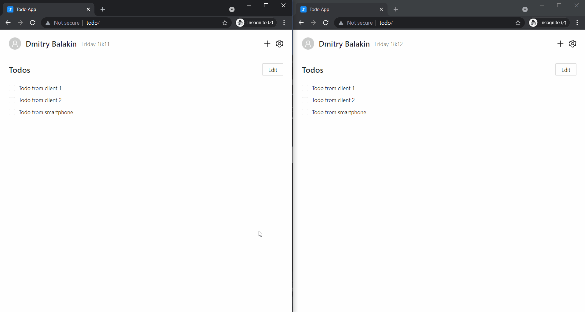
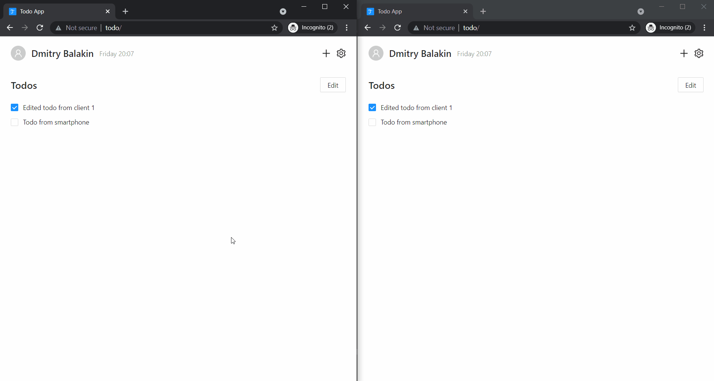
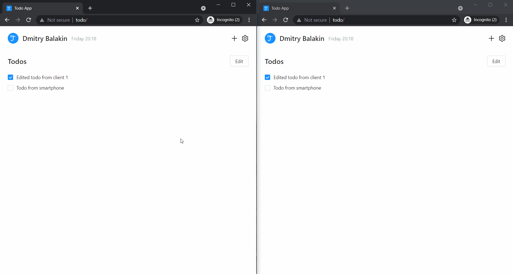

<p align="center">
  
</p>

<h1 align="center">
  Todo App
</h1>

<p align="center">
  Extremely scalable and truly reactive task list app based on MongoDB change events and HTTP server side events
</p>

## Table Of Contents

- [Technology Stack](#technology-stack)
  - [Frontend](#frontend)
  - [Backend](#backend)
- [How To Start](#how-to-start)
- [How To Deploy](#how-to-deploy)
- [Environment Variables Description](#environment-variables-description)
  - [Development Server](#development-server)
  - [HTTP Server](#http-server)
  - [HTTPS Server](#https-server)
- [Demo](#demo)
  - [Sign Up](#sign-up)
  - [Sign In](#sign-in)
  - [Create Todo](#create-todo)
  - [Edit todo](#edit-todo)
  - [Edit user](#edit-user)
  - [Logout](#logout)

## Technology Stack

### Frontend

- React
- Redux
- Ant Design
- SCSS
- CSS Modules

### Backend

- NestJS
- Fastify
- RxJS
- MongoDB
- Docker
- Traefik
- Nginx

## How To Start

Recommended editor: `Visual Studio Code`

Required tools:

- Git
- Node.js (>= v16.8.0)
- Yarn (>= 1.22.11)
- Docker (>= 20.10.8)
- Docker Compose (>= 1.29.2)

Download project:

```bash
git clone https://github.com/Trequend/todo.git
cd todo
```

Install dependencies:

```bash
yarn
```

Open dev folder:

```bash
cd docker/dev
```

(Optional) Create environment file (`.env`) from example (`.env.example`) and fill it to configure development server. [Environment variables description](#environment-variables-description).

Start development server:

```bash
docker-compose up -d
```

Connect to development server: http://localhost (default)

## How To Deploy

Required tools:

- Git
- Docker (>= 20.10.8)
- Docker Compose (>= 1.29.2)

Download project:

```bash
git clone https://github.com/Trequend/todo.git
cd todo
```

Open https folder:

```bash
cd docker/https
```

or http folder:

```bash
cd docker/http
```

Create environment file (`.env`) from example (`.env.example`) and fill it to configure application. [Environment variables description](#environment-variables-description).

Start application:

```bash
docker-compose up -d
```

## Environment Variables Description

### Development Server

`HOST`: development server address (default: localhost)

---

### HTTP Server

`HOST`: http server address (default: localhost)

`MONGO_URL`: mongodb connection url strictly without database name. The database must be "MongoDB replica set"

`MONGO_DB_NAME`: database name (default: todo)

`SESSION_MAX_AGE`: session max age in milliseconds (default: 2592000000)

`SESSION_SECRET`: session cookie secret with minimum length of 32 characters

---

### HTTPS Server

`DOMAIN`: https server domain

`EMAIL`: email for let's encrypt certificate

`MONGO_URL`: mongodb connection url strictly without database name. The database must be "MongoDB replica set"

`MONGO_DB_NAME`: database name (default: todo)

`SESSION_MAX_AGE`: session max age in milliseconds (default: 2592000000)

`SESSION_SECRET`: session cookie secret with minimum length of 32 characters

---

## Demo

### Sign Up



### Sign In



### Create Todo



### Edit Todo



### Edit User



### Logout


